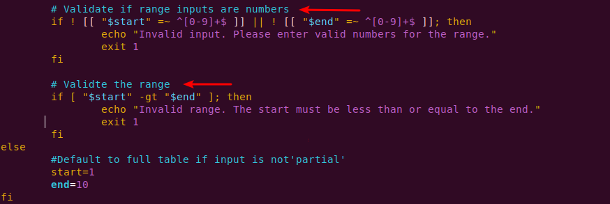

# Capstone project: Linux_shell_scripting
## This is a Bash script for generating multiplication tables

### Objective: 
To create a Bash script that generates a multiplication table for a number entered by the user.

## Description:
The script will prompt the user to enter a number and then ask if they prefer to see a full multiplication table from 1-10 or a partial table within a specified range. Based on the user's choice, the script will display the corresponding multiplication table.

## Script Flow:
To start, I created a new directory named "Capstone-project" and navigated int it with the command `capstone_project`
Then in the directory I created a file using the vim editor to enable me write the script.

User input for number: The script first ask the user to input a number for which the multiplication table will be generated.

Choice of table range: Next ask the user if they want a full multiplication table (1-10) or a partial table. If they choose partial, prompt them for the start and end of the range.

Validation: The script validates if range inputs are numbers
It also validates range and defaults to full table if inpute is not valid. 

Generates and displays the multiplication table according to the user's specified range while providing clear output formating for ease of reading

Below is the output for a partial multiplication table, if the user chooses a partial table:
[Partial](./img/4.partial.png)

Below is handling invalid input
[invalid](./img/5.invalid.png)

The script can be used to generate multiplication table for any number
[new number](./img/7.newer.png)
[newr](./img/6.new.png)

The script:
[the script](./img/8.%20the%20script.png)

